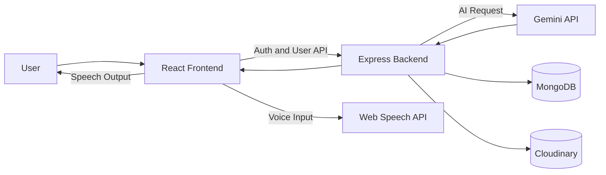
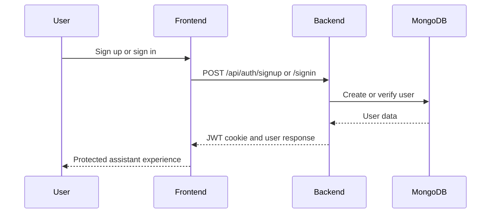
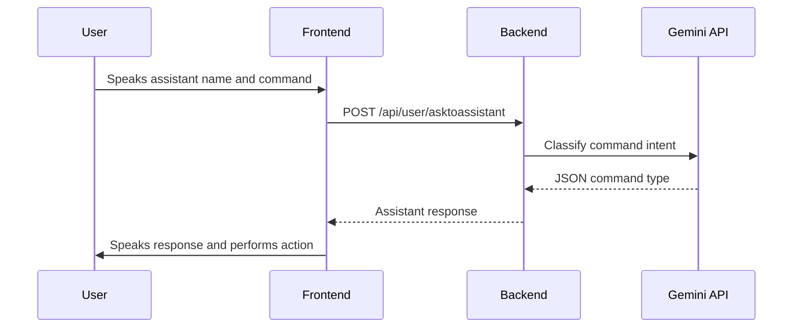
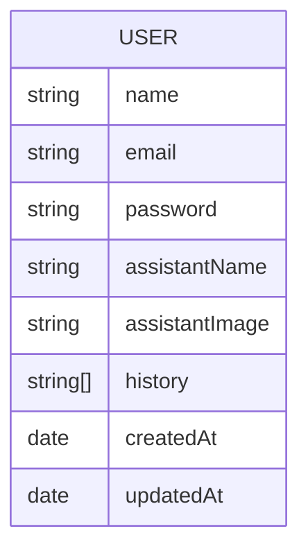

# 🤖 Gemini Virtual Assistant

> **A Modern Full Stack AI Voice Assistant built with the MERN Stack, Gemini API, Web Speech API, MongoDB, and Cloudinary**

---

# 📑 Table of Contents

- Overview
- Project Goals
- Features
- Tech Stack
- Highlights
- System Architecture
- Project Workflow
- Folder Structure
- Database Schema
- REST API
- Voice Command Flow
- Installation
- Environment Variables
- Deployment
- Future Improvements
- License
- Acknowledgements
- Author

---

# 📖 Overview

Gemini Virtual Assistant is a full stack AI-powered personal assistant application. Users can register, log in, customize their assistant name and avatar, then interact with the assistant using voice commands.

The assistant uses Gemini to understand user intent, Web Speech APIs for voice input and spoken responses, MongoDB for user data and command history, Cloudinary for assistant image uploads, and a React frontend for a smooth personalized experience.

## 🎯 Project Goals

- Build a personalized AI voice assistant
- Implement secure JWT authentication
- Integrate Gemini API for command understanding
- Use browser speech recognition and speech synthesis
- Store users and assistant data in MongoDB
- Upload custom assistant avatars using Cloudinary
- Create a responsive React user interface

---

# ✨ Features

## 🔐 Authentication

- User Registration
- Secure Login and Logout
- JWT-Based Authentication
- Cookie-Based Session Handling
- Password Hashing using bcryptjs
- Protected Frontend Routes

## 🤖 Assistant Customization

- Create a Personalized Assistant Name
- Choose from Built-In Assistant Avatars
- Upload Custom Assistant Image
- Store Assistant Profile in MongoDB
- Cloudinary Image Upload Support

## 🎙 Voice Assistant

- Wake Word Style Interaction using Assistant Name
- Speech Recognition using Browser Web Speech API
- Spoken Assistant Replies using Speech Synthesis
- Continuous Listening Mode
- Sleep Mode using voice command
- Duplicate Command Protection
- Recent Session History Panel

## 🧠 Gemini AI Commands

- General Questions
- Google Search
- YouTube Search
- YouTube Play
- Current Time
- Current Date
- Current Day
- Current Month
- Open Instagram
- Open Facebook
- Open Calculator
- Weather Search

## 📱 Responsive UI

- Modern Authentication Pages
- Assistant Home Dashboard
- Avatar Selection Grid
- Mobile Friendly Navigation
- Recent History Drawer
- Clean Gradient-Based Interface

---

# 🛠 Tech Stack

## Frontend

- React
- Vite
- React Router DOM
- Axios
- Tailwind CSS
- React Icons
- Web Speech API

## Backend

- Node.js
- Express.js
- JWT
- bcryptjs
- Cookie Parser
- CORS
- Multer
- Axios
- Moment.js

## Database

- MongoDB
- Mongoose

## AI and Cloud

- Gemini API
- Cloudinary

---

# ⭐ Highlights

- ⚡ AI-Powered Voice Interaction
- 🔒 Secure Cookie Authentication
- 🎨 Custom Assistant Avatar Setup
- ☁️ Cloudinary Image Uploads
- 🧠 Gemini Intent Classification
- 🗣 Speech Recognition and Text-to-Speech
- 📦 REST API Architecture
- 📱 Responsive Full Stack Design

---

# 🏗 System Architecture



# 🔐 Authentication Flow



# 🎙 Voice Command Flow



---

# 🔄 Project Workflow

1. User creates an account or logs in.
2. Backend creates a JWT token and stores it in an HTTP-only cookie.
3. User customizes assistant name and image.
4. Assistant image is selected from frontend assets or uploaded to Cloudinary.
5. User opens the assistant home screen.
6. Browser speech recognition listens for the assistant name.
7. Command is sent to the backend.
8. Backend asks Gemini to classify the command.
9. Frontend performs the command action and speaks the response.

---

# 📁 Folder Structure

```text
Gemini_Virtual_Assistant-main/
├── backend/
│   ├── config/
│   │   ├── cloudinary.js
│   │   ├── db.js
│   │   └── token.js
│   ├── controllers/
│   │   ├── auth.controller.js
│   │   └── user.controller.js
│   ├── middlewares/
│   │   ├── isAuth.js
│   │   └── multer.js
│   ├── modals/
│   │   └── user.models.js
│   ├── routes/
│   │   ├── authRoutes.js
│   │   └── userRoutes.js
│   ├── gemini.js
│   ├── index.js
│   └── package.json
├── frontend/
│   ├── public/
│   ├── src/
│   │   ├── assets/
│   │   ├── context/
│   │   │   └── UserContext.jsx
│   │   ├── pages/
│   │   │   ├── customize.jsx
│   │   │   ├── home.jsx
│   │   │   ├── signIn.jsx
│   │   │   └── signUp.jsx
│   │   ├── App.jsx
│   │   ├── index.css
│   │   └── main.jsx
│   ├── index.html
│   ├── package.json
│   └── vite.config.js
└── README.md
```

---

# 🗄 Database Schema



---

# 🌐 REST API

## Authentication

| Method | Endpoint | Description |
|---|---|---|
| POST | `/api/auth/signup` | Create a new user account |
| POST | `/api/auth/signin` | Login existing user |
| POST | `/api/auth/logout` | Logout user and clear cookie |

## User and Assistant

| Method | Endpoint | Description |
|---|---|---|
| GET | `/api/user/current` | Get current authenticated user |
| POST | `/api/user/update` | Update assistant name and image |
| POST | `/api/user/asktoassistant` | Send command to Gemini assistant |

---

# 🧠 Supported Command Types

| Type | Action |
|---|---|
| `general` | Answer a normal question |
| `google_search` | Open Google search results |
| `youtube_search` | Open YouTube search results |
| `youtube_play` | Search and play content on YouTube |
| `get_time` | Return current time |
| `get_date` | Return current date |
| `get_day` | Return current day |
| `get_month` | Return current month |
| `calculator_open` | Open calculator |
| `instagram_open` | Open Instagram |
| `facebook_open` | Open Facebook |
| `weather_show` | Search weather information |

---

# ⚙️ Installation

## Clone

```bash
git clone https://github.com/yourusername/gemini-virtual-assistant.git
cd gemini-virtual-assistant
```

## Backend

```bash
cd backend
npm install
npm run dev
```

Backend runs on:

```text
http://localhost:5000
```

## Frontend

```bash
cd frontend
npm install
npm run dev
```

Frontend runs on:

```text
http://localhost:5173
```

---

# 🔑 Environment Variables

Create a `.env` file inside the `backend` folder.

```env
PORT=5000
MONGODB_URL=
JWT_SECRET=
NODE_ENV=development

GEMINI_URL=
GEMINI_API_KEY=

CLOUDINARY_CLOUD_NAME=
CLOUDINARY_API_KEY=
CLOUDINARY_API_SECRET=
```

---

# 🚀 Deployment

- Frontend:  Render link : https://gemini-virtual-assistant.onrender.com
- Backend: Render  
- Database: MongoDB Atlas
- Image Storage: Cloudinary
- AI API: Gemini API

Current frontend code uses this backend URL:

```text
https://gemini-virtual-assistant-backend.onrender.com
```

For local development, update `serverUrl` in:

```text
frontend/src/context/UserContext.jsx
```

---

# 🔮 Future Improvements

- Add editable assistant profile after setup
- Add persistent full command history page
- Add voice selection and language settings
- Add dark/light theme toggle
- Add better error messages for microphone permissions
- Add support for more apps and command types
- Add frontend environment variable for backend URL
- Add tests for backend routes and Gemini response parsing
- Add refresh token support
- Add production-ready CORS configuration

---

# 📄 License

ISC License

---

# 🙏 Acknowledgements

- React
- Vite
- Node.js
- Express.js
- MongoDB
- Mongoose
- Gemini API
- Cloudinary
- Tailwind CSS
- React Icons

---

# 👨‍💻 Author

**Ravi Kumar Sharma**

- Full Stack MERN Developer
- B.Tech CSE Student
- NIT Sikkim
